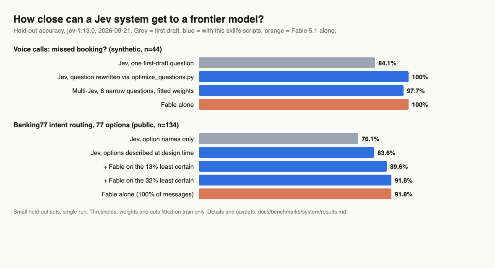
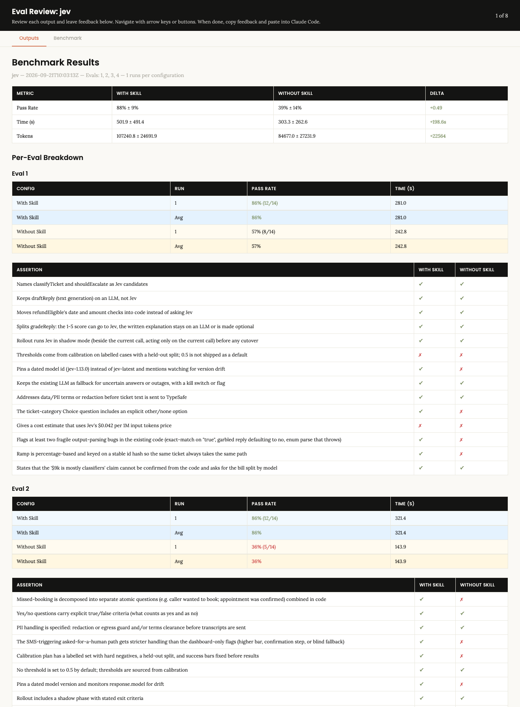

# jev-skill

An agent skill for **TypeSafe AI's Jev** decision model. It covers where Jev fits, and how to design,
integrate, calibrate and ship it.

Jev answers typed questions about text and returns a probability with each answer. The three question
types are yes/no, pick one of up to 255 options, and a rating on 2-10 levels. It is about 100x cheaper
than a frontier LLM call and barely varies between runs. It cannot write, count or compare dates, and
it can be confidently wrong.

TypeSafe's [official skill](https://github.com/typesafe-ai/skills) teaches the API. This one covers
what it leaves out:

| | Official skill | This skill |
|---|---|---|
| API syntax, pattern catalogue | yes (via live docs) | defers to it |
| Go / no-go fit check | no | `scripts/fit_check.py` + sourced use-case map (22 placements) |
| Finding candidates in an existing codebase | no | `scripts/find_decision_calls.py` |
| Getting accuracy toward a frontier model (question rewriting with a referee, multi-Jev, cascade) | no | `scripts/optimize_questions.py`, `scripts/ensemble.py`, `references/optimization.md` |
| Calibration method (thresholds, held-out split, three-way bands) | "evaluate on your data" | `scripts/calibrate.py` + `references/calibration.md` |
| Brownfield / mid-project / greenfield rollout recipes | no | `references/integration.md` |
| PRD template | no | `assets/prd-template.md` |
| Dated facts, failure modes, evidence strength | no | `references/facts.md`, `references/fit-map.md` |

## How close can a Jev system get to a frontier model?

Jev cannot be fine-tuned, so the skill moves the intelligence into the question text, the composition
and a cascade. Same held-out cases for every setup; thresholds, weights and cuts fitted on train only.



| | Voice: missed booking (synthetic, n=44) | Banking77, 77-way routing (public, n=134) |
|---|---|---|
| Jev, first-draft question | 84.1% | 76.1% |
| Jev, question rewritten with `optimize_questions.py` | **100%** | **83.6%** |
| Multi-Jev, fitted weights (`ensemble.py`) | 97.7% | 83.6% (no gain: paraphrases err together) |
| + Fable 5.1 on the least certain share | 100% (18% sent) | 89.6% (13% sent), 91.8% (32% sent) |
| Fable 5.1 alone | 100% | 91.8% |
| Jev cost per 1k items | $0.006 to $0.04 | $0.09 |

Goal was "within 3 points of the frontier model while sending it at most 10% of cases":
- **Voice:** met. Synthetic, n=44.
- **Banking77:** accuracy met, escalation share missed by 3 points.

Small sets, single run. Full tables, caveats and reproduction steps are in
[`docs/benchmarks/system/results.md`](docs/benchmarks/system/results.md). The whole benchmark cost
about $0.12 of Jev calls.

## Does the skill change what an agent produces?

### Round 2 (harder checks, weaker agent)

Four realistic tasks, each run once with and without the skill, both sides on Claude Sonnet, graded by a
separate agent against 42 written checks. The checks were made harder after round 1, and task 4 is
new: close an accuracy gap on 160 labelled calls with live Jev calls.

| Task | With skill | Without skill |
|---|---|---|
| 1. Plan for an existing support-bot repo | 12 / 14 | 8 / 14 |
| 2. PRD for voice-call QA | 12 / 14 | 5 / 14 |
| 3. Six proposed uses, which should use Jev | 7 / 9 | 2 / 9 |
| 4. Close the accuracy gap, show numbers | 5 / 5 | 2 / 5 |
| **Total** | **36 / 42 (86%)** | 17 / 42 (40%) |
| Time per task | 502 s | 303 s |
| Tokens per task | 107k | 85k |



The clearest difference was task 4. Without the skill the agent reported 100%, measured on the same
160 calls it had tuned its wording on. With the skill it split the data first, read train failures
only, and reported 81.8% to 97.7% (rewrite) to 100% (four-question ensemble) on 44 held-out calls,
with the threshold fitted on train.

What the skill run still got wrong (open work, not hidden):
- Task 1: no held-out split or "never 0.5" language, and it refused to give a cost estimate instead
  of giving one with stated assumptions.
- Task 2: the PRD was 278 lines (limit 250) and left the business-hours rule for the SMS as an open question.
- Task 3: no calibration step for email routing, and no "which lever if accuracy is short" note.

Read this with care: one run per cell, the skill costs more time and tokens (task 4 took 20 minutes
with live calibration), one check on the no-skill side of task 4 passed only because no cascade was
presented, and the same author wrote both the skill and the checks. Raw data: [`docs/benchmarks/iteration-2/`](docs/benchmarks/iteration-2/).

### Round 1

Three realistic tasks, each run once by the same agent with and without the skill, graded
blind by a separate agent against 30 written checks.

| | With skill | Without skill |
|---|---|---|
| Checks passed | **30 / 30** | 20 / 30 |
| Time per task | 180 s | 202 s |
| Tokens per task | 82k | 68k |


What the agent got wrong without the skill:
- It shipped 0.5 as the default threshold.
- It left out the `other` option on a category question.
- It called RAG grounding a "strong fit" with no caveat about numbers.
- It used the moving `jev-latest` alias.
- It said resume screening "fits technically".
- It wrote no verification steps.

Read this with care:
- One run per cell, so there is no variance estimate.
- The skill scored 30/30, so these checks cannot tell a good run from a great one.
- On things the checks did not cover, the no-skill runs were sometimes better: they found 3 real
  bugs in the fixture repo, and one PRD was 40% shorter.
- Raw data: [`docs/benchmarks/iteration-1/`](docs/benchmarks/iteration-1/).

## Install

```bash
# Claude Code plugin
claude plugin marketplace add abhisheksharma001/jev-skill
claude plugin install jev

# or any Agent Skills host: copy the folder
cp -r skills/jev ~/.claude/skills/jev
```

Scripts need Python 3.9+ with the standard library only. Live calls need `TYPESAFE_API_KEY`.

## Try it

```bash
python3 skills/jev/scripts/fit_check.py --template > answers.json    # fill in true/false
python3 skills/jev/scripts/fit_check.py --answers answers.json
python3 skills/jev/scripts/find_decision_calls.py /path/to/your/repo
python3 skills/jev/scripts/calibrate.py --cases cases.jsonl --questions q.json --band
```

## Where the content comes from

A bounded research run on 2026-09-21 using [research-council](https://github.com/abhisheksharma001/research-council):
- 190+ evidence records, 87 of them from independent adopters.
- About 250 live probe calls on synthetic text.
- A hostile review pass, whose objections changed five verdicts.

Every placement verdict states whether its evidence is independent, partner-sourced, or absent.

Jev launched on 2026-09-15, so all of this is early. Measure on your own cases.

## Honest limits

- Most public results are small (n=5 to n=2,000) and a week old.
- Probe cases are synthetic and author-labelled, so they give direction only.
- Not tested: non-English accuracy, long-context grounding (>6k tokens), a cheap-LLM baseline, the
  community n8n node.
- The frontier baseline ran through Claude Code subagents, so it cannot be re-run from an API key;
  its predictions are committed.
- Not affiliated with TypeSafe AI.

MIT licensed.
