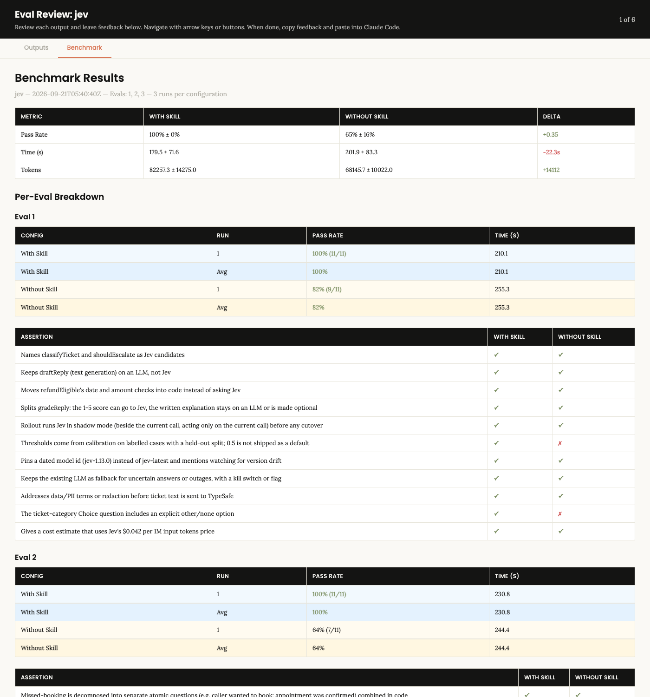

# jev-skill

An agent skill for **TypeSafe AI's Jev** decision model. It covers where Jev fits, and how to design,
integrate, calibrate and ship it.

Jev answers typed questions about text and returns a probability with each answer. The three question
types are yes/no, pick one of up to 255 options, and a rating on 2-10 levels. It is about 100x cheaper
than a frontier LLM call and barely varies between runs. It cannot write, count or compare dates, and
it can be confidently wrong.

TypeSafe's [official skill](https://github.com/typesafe-ai/skills) teaches the API. This one covers
what it leaves out:

| | Official skill | This skill |
|---|---|---|
| API syntax, pattern catalogue | yes (via live docs) | defers to it |
| Go / no-go fit check | no | `scripts/fit_check.py` + sourced use-case map (22 placements) |
| Finding candidates in an existing codebase | no | `scripts/find_decision_calls.py` |
| Calibration method (thresholds, held-out split, three-way bands) | "evaluate on your data" | `scripts/calibrate.py` + `references/calibration.md` |
| Brownfield / mid-project / greenfield rollout recipes | no | `references/integration.md` |
| PRD template | no | `assets/prd-template.md` |
| Dated facts, failure modes, evidence strength | no | `references/facts.md`, `references/fit-map.md` |

## Does the skill change what an agent produces?

Round 1: three realistic tasks, each run once by the same agent with and without the skill, graded
blind by a separate agent against 30 written checks.

| | With skill | Without skill |
|---|---|---|
| Checks passed | **30 / 30** | 20 / 30 |
| Time per task | 180 s | 202 s |
| Tokens per task | 82k | 68k |



What the agent got wrong without the skill:
- It shipped 0.5 as the default threshold.
- It left out the `other` option on a category question.
- It called RAG grounding a "strong fit" with no caveat about numbers.
- It used the moving `jev-latest` alias.
- It said resume screening "fits technically".
- It wrote no verification steps.

Read this with care:
- One run per cell, so there is no variance estimate.
- The skill scored 30/30, so these checks cannot tell a good run from a great one.
- On things the checks did not cover, the no-skill runs were sometimes better: they found 3 real
  bugs in the fixture repo, and one PRD was 40% shorter.
- Raw data: [`docs/benchmarks/iteration-1/`](docs/benchmarks/iteration-1/).

## Install

```bash
# Claude Code plugin
claude plugin marketplace add abhisheksharma001/jev-skill
claude plugin install jev

# or any Agent Skills host: copy the folder
cp -r skills/jev ~/.claude/skills/jev
```

Scripts need Python 3.9+ with the standard library only. Live calls need `TYPESAFE_API_KEY`.

## Try it

```bash
python3 skills/jev/scripts/fit_check.py --template > answers.json    # fill in true/false
python3 skills/jev/scripts/fit_check.py --answers answers.json
python3 skills/jev/scripts/find_decision_calls.py /path/to/your/repo
python3 skills/jev/scripts/calibrate.py --cases cases.jsonl --questions q.json --band
```

## Where the content comes from

A bounded research run on 2026-09-21 using [research-council](https://github.com/abhisheksharma001/research-council):
- 190+ evidence records, 87 of them from independent adopters.
- About 250 live probe calls on synthetic text.
- A hostile review pass, whose objections changed five verdicts.

Every placement verdict states whether its evidence is independent, partner-sourced, or absent.

Jev launched on 2026-09-15, so all of this is early. Measure on your own cases.

## Honest limits

- Most public results are small (n=5 to n=2,000) and a week old.
- Probe cases are synthetic and author-labelled, so they give direction only.
- Not tested: non-English accuracy, long-context grounding (>6k tokens), a cheap-LLM judge baseline,
  the community n8n node.
- Not affiliated with TypeSafe AI.

MIT licensed.
